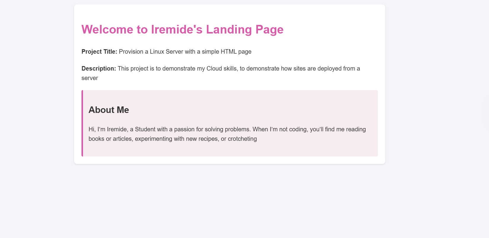

# SecondSemester_Cloud_Project
This repository is a Project examination assigned to me. It's just a simple website I deployed.

**<u>Step-by-step documentation of how I provisioned the server, installed the web server, deployed the HTML page, and configured networking.</u>**

***Cloud Provider used:*** AWS <br>
***IP address:*** 35.179.147.230
1. **Launching and Configuring a New Instance:** I launched a new instance, using Ubuntu as my as the operating system. I configured the CPU, memory and network settings based on the performance needs. I generated a new ssh key for my instance using AWS and saved the key in pem form as this key would be used to securely connect to my server.
2. **Setting Up Security Groups and Network:** I defined the inbound traffic to allow HTTP traffic and I also defined HTTPS rule like this:
   *   HTTP rule:
         - Type: HTTP
         - Protocol: TCP
         - Port Range: 80
         - Destination: 0.0.0.0/0 (for IPv4) and ::/0 (for IPv6) to allow traffic to any IP address.
   * Similarly, I added a rule for HTTPS:
       - Type: HTTPS
       - Protocol: TCP
       - Port Range: 443
       - Destination: 0.0.0.0/0 (for IPv4) and ::/0 (for IPv6) to allow traffic to any IP address.

3. **Connecting to my server:** Using my local terminal(bash) I connected to my server using the command:
    ```bash
    ssh -i ~/.ssh/sshKey.pem ubuntu@35.179.147.230
    ```
4. **Updating and Securing my Server:** Once connected, I updated the package lists and upgraded installed packages:
    ```bash
    sudo apt update && sudo apt upgrade -y
    ```
    Then I installed all necessary security updates and configure additional security measures, such as setting up a firewall with `ufw` (Uncomplicated Firewall):
    ```bash
    sudo ufw allow OpenSSH
    sudo ufw enable
    ```
5. **Installing Apache2:** Apache is the webserver for linux machines. I installed apache webserver using this command:
   ```bash
   sudo apt install apache2
   ``` 
6. **Configuring Apache web server:** By default, Apache serves files from the `/var/www/html` directory. I    copied the html file here.
   ```bash
   sudo cp index.html /var/www/html
   ```
7. **Setting permissions:** I ensured the web server had the corrected permissions to read the files. I used these commands to modify the ownership and permissions of `/var/www/html`.
   ```bash
   sudo chown -R www-data:www-data /var/www/html
   sudo chmod -R 755 /var/www/html
   ```
8. **Restarted Apache:** I restarted apache to apply the changes. Voilà! the site can be viewed using the public ip address of the machine.
   ```bash
   sudo systemctl restart apache2
   ```

## How I added SSL Certificate
   1. **Chose a Certificate Authority(CA):** I chose let's encrypt. They provide free, automated and open certificate
   2. **Installed Certbot:** Certbot is a tool that automates the process of obtaining and renewing Let’s Encrypt SSL certificates. The installation process varies depending on your web server and operating system. I used a Linux machine and Apache webserver for this project:
      ```bash
        sudo apt install certbot python3-certbot-apache
      ```
   3. **Obtained the SSl certificate:** I used this command to obtain and install the certificate
      ```bash
      sudo certbot --apache -d example.com -d www.example.com
      ```
   4. **Verified the installation:** Certbot automatically configures your web server to use the new certificate. I verified the installation by visiting my site using `https://`


You can view the deployed site [here](www.iremide.mooo.com).
